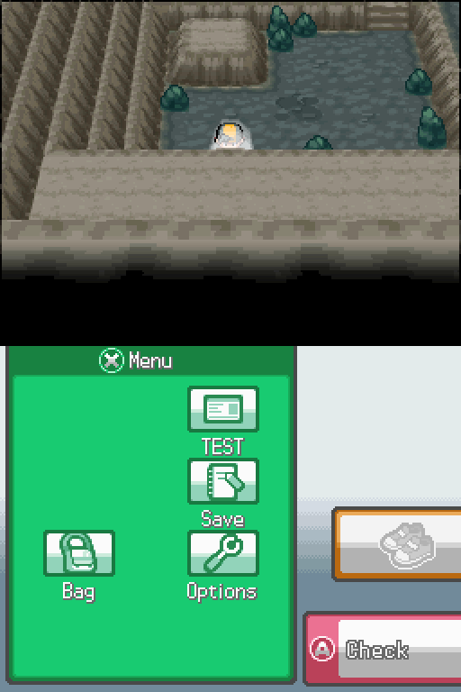

# Sacred Gold Plus

**A fan-made continuation of Sacred Gold Plus, for the Nintendo DS.**

**Version 1.2.1** · **License:** [GPL-3.0-or-later](LICENSE) (this project's own tools; third-party rights below)

Sacred Gold Plus adds Fairy typing, new Fairy moves and a wider camera option to Drayano's *Sacred Gold*. This continuation keeps that foundation and adds an Italian translation, a native indoor camera, adjustable difficulty, and a set of quality fixes.

This is a **patch**, not a ROM: you apply it to your own legally obtained game file. No game file is distributed here.

## Screenshots

| | |
| --- | --- |
|  Title screen |  Exploring Cherrygrove City |
|  A trainer battle with Plus difficulty on |  The Sacred Gold Plus options page |
|  Indoors before: the wide camera letterboxes the top screen |  Indoors after: the classic camera, restored natively |
|  The one-time prompt on Continue | |

## What's new in 1.2.1 — updated 15 September 2026

- **42 full pages in the main Bag pocket:** 252 slots. All eight pockets have capacities divisible by six: items 252, medicine 42, Balls 30, TM/HM 102, berries 66, mail 12, battle items 30 and key items 60.
- **Smoother optional battle motion.** Interpolated movement and corrected cleanup; shorter Bag and party loading pauses. In the tested EN/IT battles, Bag opening drops from 55 to 7 frames and party opening from 33 to 20. Brief loading pauses remain.
- **Search all 493 wild Pokémon and choose a level from 1 to 100** with this project's [melonDS Android 2.1.1 build](https://github.com/Umberto-DEV/melonDS-android/releases/tag/v2.1.1). Leave the code enabled and press **L+R** to toggle it in game; it starts off. The selector works in grass with Wild levels off.
- **Corrected male/female + nature cheats**, including Cute Charm. The catalogue contains 2,110 codes in 67 folders; the obsolete clean-ROM overlay patch was removed. Maximum-IV and manual species/level choices remain available. [Validation scope](source/docs/cheat-catalogue-validation.md).
- Free gifts and pickups no longer block progress at a full item stack. Rare Candies can be used consecutively from the party menu. NPC smoothing changes take effect immediately and unavailable save options cannot be changed.
- Existing saves import into the expanded Bag. **Older ROMs cannot access its extra slots; saving in an older ROM prevents automatic recovery of those slots.** Update using the game's normal save, not an old emulator savestate.

## What's new (1.04 → 1.2)

- **Plus difficulty** extended to levels: tougher trainers and, separately, scaling wild Pokémon — both optional, both capped at level 100.
- A **Sacred Gold Plus options page** (press SELECT during play); the game asks once, on Continue, whether you want to look at it.
- The **classic HeartGold camera**, restored natively in eight indoor maps (Mahogany Town, Mt. Mortar) — no cheat needed.
- **Smoother towns**: fewer characters loaded at once when entering or leaving one.
- **Optional animated Pokémon** in battle (off by default).
- **Online server choice**: pick which Wi-Fi connection slot handles GTS and battles; Mystery Gift connects automatically.
- **200+ text corrections** in English and Italian.
- A cleaner **title screen**, with a single credit line.
- The **EV/IV guide** on a Pokémon's Ability page (in the summary) no longer shows an automatic "START Guide" label; press START there to open it.
- **Bug fixes.**
- **Saves from 1.1 are compatible.**

## Download

Get the ZIP for your language from the [**1.2.1 release**](https://github.com/Umberto-DEV/sacred-gold-plus/releases/tag/v1.2.1):

| Language | File |
| --- | --- |
| Italian | `Sacred-Gold-Plus-1.2.1-IT.zip` |
| English | `Sacred-Gold-Plus-1.2.1-US.zip` |

Each ZIP contains the patch, the recommended cheats, the manuals and the installation guide for that language.

## Requirements

- An unmodified **Pokémon HeartGold** ROM, US or Italian, **or** an existing **Sacred Gold Plus 1.03, 1.04 or 1.1** ROM (any camera) — you must obtain this yourself.
- A DS patching tool: a desktop program, an Android app, or a browser page (all free; links are in the package guide).
- An emulator or a flashcart. The searchable picker and L+R toggle require [this fork’s melonDS Android 2.1.1](https://github.com/Umberto-DEV/melonDS-android/releases/tag/v2.1.1).

## Install

1. Back up your game file and your save.
2. Open the ZIP, pick the patch matching your current file from its `Patch` folder, and apply it with one of the supported tools.
3. Follow `HOW-TO-INSTALL.txt` (English) or `COME-INSTALLARE.txt` (Italian) inside the package for the full step-by-step guide.

## Compatibility

- **Saves:** existing 1.1/1.2/earlier 1.2.1 saves import. Extra Bag slots use a save extension; older ROMs do not expose those items, and saving there prevents automatic recovery of the extra slots. Keep a backup when changing ROM builds and load the normal in-game save.
- **Cheats:** the game header is unchanged from 1.2, but import the updated catalogue to get the corrected codes. 1.1 catalogues have a different header. Every supplied code starts disabled.

## Source code and contributing

Everything that builds and checks this game is in [`source/`](source/README.md): the library that rebuilds 1.2.1 from a 1.1 ROM with one command and verifies it with another, one folder per feature with our C sources, tools and tests, and the technical reference in [`source/docs/`](source/docs/).

- `main` is the development trunk. Fork, create a `feature/…` or `fix/…` branch, open a pull request.
- Every push and pull request runs the tests that need no game file (`source/run_tests.py`). Building the game needs your own copy of it, so that step happens on your machine, never on GitHub; the pull request template asks what you ran locally.
- Finished versions are tags (`v1.2.1`) with the player ZIPs attached to the [release](https://github.com/Umberto-DEV/sacred-gold-plus/releases); previews are marked pre-release.
- Never commit ROMs, saves, BIOS, dumps, game text or extracted game data. The public-file check in CI refuses them.

## Credits

Built on **Drayano**'s *Sacred Gold* and Storm Silver; **mikelan / Mikelan98** contributed the Fairy-type implementation; **NefariousnessNo3436** created Sacred Gold Plus and its 1.03 additions, and [allowed reuse with credit](https://www.reddit.com/r/PokemonROMhacks/comments/1m69jrj/sacred_gold_plus_fairy_type_full_implementation/). This is an independent continuation, not an official handover. The original PDF guides in the packages remain credited to Drayano and the original contributors; **@JD48096761** compiled the trainer reference. Developed by a fan, with community contributions.

Third-party material used by the tools, none of it redistributed here: the character mapping from [pret/pokeheartgold](https://github.com/pret/pokeheartgold) (read from your own checkout), [ndspy](https://github.com/RoadrunnerWMC/ndspy), [Unicorn](https://www.unicorn-engine.org/) and [Capstone](https://www.capstone-engine.org/) as pinned dependencies, and the [melonDS](https://melonds.kuribo64.net/) core (GPL-3.0-or-later) as the base of the headless test bench you build yourself.

## License

This project's own tools and sources are licensed under [GPL-3.0-or-later](LICENSE). Pokémon, the original game and third-party contributions remain under their owners' rights; attribution does not transfer them. No game code, text, graphics, ROM, BIOS or save is distributed here.

---

## In italiano

**Sacred Gold Plus** è una continuazione amatoriale di Sacred Gold Plus per Nintendo DS: tipo Folletto, nuove mosse Folletto e camera panoramica, con in più traduzione italiana, camera originale negli interni, difficoltà regolabile e correzioni.

Questa è una **patch**, non una ROM: va applicata a una copia posseduta legalmente del gioco. Nessun file di gioco è distribuito qui.

**Novità della 1.2.1 — aggiornamento del 15 settembre 2026:** borsa principale da **252 slot, 42 pagine complete**. Tutte le tasche hanno capienza multipla di sei: strumenti 252, medicine 42, Ball 30, MT/MN 102, bacche 66, posta 12, strumenti lotta 30, strumenti base 60. Animazioni opzionali di lotta più fluide, con aperture di Borsa e Squadra più rapide; restano brevi pause di caricamento.

**Selvatici:** nel [melonDS Android 2.1.1 di questo progetto](https://github.com/Umberto-DEV/melonDS-android/releases/tag/v2.1.1) scegli fra tutti i **493 Pokémon** con ricerca e imposti il livello **1–100**. Lascia il codice abilitato: in gioco parte spento, **L+R** lo attiva e una nuova pressione lo spegne. Vale per l'erba alta con Livelli selvatici OFF. Corretti anche i codici maschio/femmina + natura. Catalogo aggiornato: **2.110 codici in 67 cartelle**, con [rapporto di verifica](source/docs/cheat-catalogue-validation.md).

**Novità della 1.2:** difficoltà Plus estesa ai livelli (selvatici e allenatori, tetto 100); pagina Opzioni Sacred Gold Plus (tasto SELECT), con domanda una tantum al Continua; camera classica ripristinata in otto interni (Mogania, Monte Scodella); città più fluide; Pokémon animati in lotta (spenti di default); scelta dello slot Wi-Fi per GTS e lotte, con Dono Segreto automatico; oltre 200 correzioni ai testi; titolo con un solo credito; nella pagina Abilità del riepilogo l'etichetta automatica «START Guida» non compare più (premi START per aprire la guida EV/IV); correzioni varie; **i salvataggi della 1.1 sono compatibili**.

**Download:** dalla [release 1.2.1](https://github.com/Umberto-DEV/sacred-gold-plus/releases/tag/v1.2.1), `Sacred-Gold-Plus-1.2.1-IT.zip` o `-US.zip`.

**Requisiti:** ROM HeartGold originale (USA o Italia) oppure Sacred Gold Plus 1.03, 1.04 o 1.1 (qualsiasi camera); un programma di patching (guide nel pacchetto); il selettore con ricerca e L+R richiede melonDS Android 2.1.1 di questo progetto.

**Installazione:** (1) backup di gioco e salvataggio; (2) applica la patch giusta dalla cartella `Patch` con uno dei programmi supportati; (3) segui `COME-INSTALLARE.txt` nel pacchetto per la guida completa.

**Compatibilità:** i salvataggi esistenti vengono importati. Gli slot aggiuntivi della Borsa usano un’estensione del salvataggio: tornando a una ROM vecchia, gli oggetti negli slot extra non sono disponibili; salvando con quella ROM non si recuperano automaticamente al ritorno. Carica il salvataggio normale del gioco, non un savestate precedente. L’intestazione è invariata dalla 1.2, ma importa il catalogo aggiornato per le correzioni. Tutti i codici sono spenti di default.

**Per chi sviluppa:** i sorgenti, gli strumenti e i test stanno in [`source/`](source/README.md). `main` è il tronco di sviluppo; si lavora su un branch e si apre una pull request; la ROM si costruisce sulla propria macchina, con il proprio file di gioco, mai su GitHub.

**Crediti:** basato su *Sacred Gold* di **Drayano**, continuazione di **Sacred Gold Plus** con credito alla community originale. Sviluppato da un appassionato, con contributi della community.

**Licenza:** strumenti di questo progetto sotto [GPL-3.0-or-later](LICENSE); Pokémon, il gioco originale e i contributi di terzi restano dei rispettivi proprietari — crediti completi in `LEGGIMI.txt` nel pacchetto.
