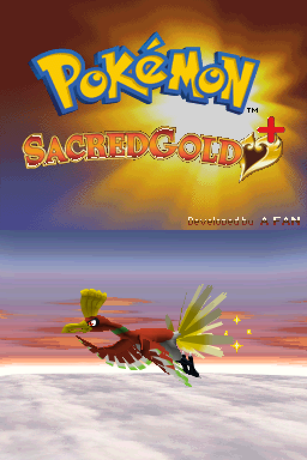
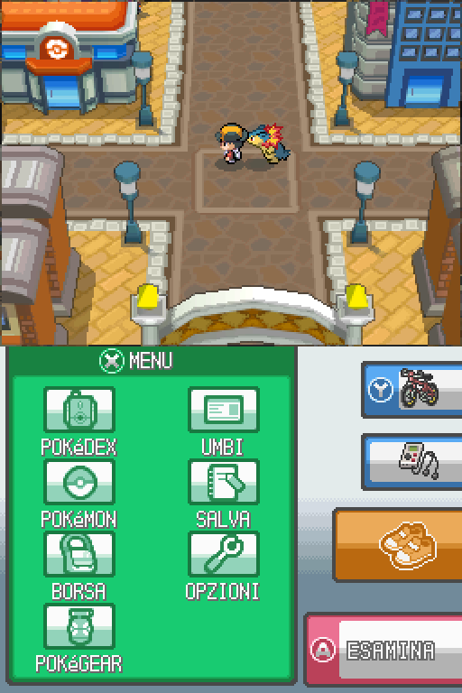
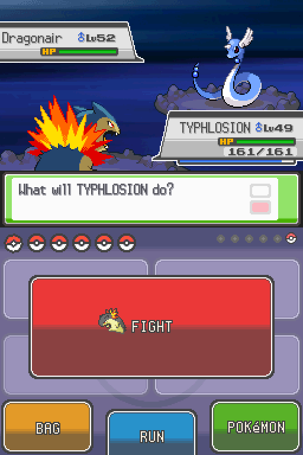
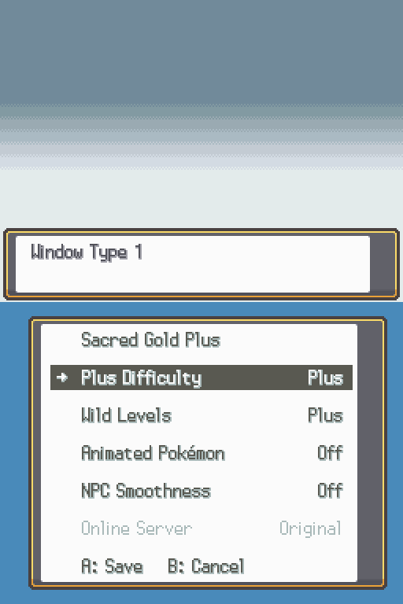
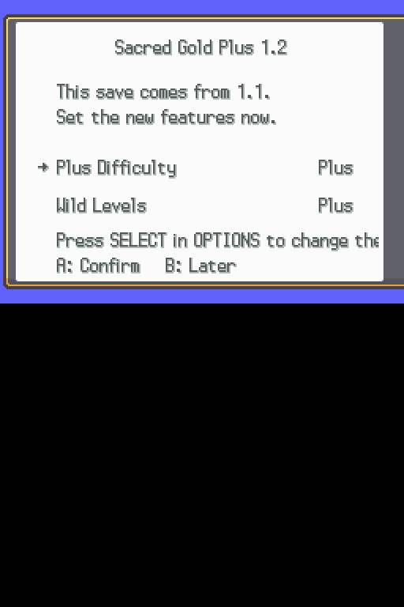
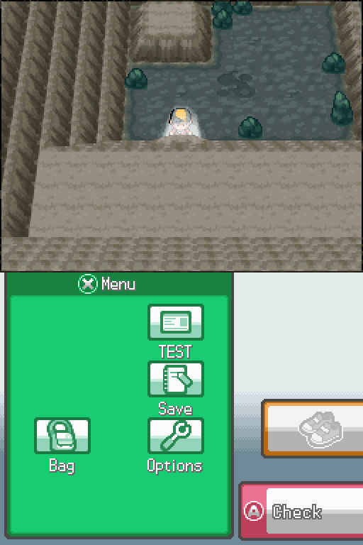

<!-- Sacred Gold Plus 1.2 — public player README (draft) -->

# Sacred Gold Plus

**A fan-made continuation of Sacred Gold Plus, for the Nintendo DS.**

**Version 1.2** · **License:** [GPL-3.0-or-later](LICENSE) (this project's own tools; third-party rights below)

Sacred Gold Plus adds Fairy typing, new Fairy moves and a wider camera option to Drayano's *Sacred Gold*. This continuation keeps that foundation and adds an Italian translation, a native indoor camera, adjustable difficulty, and a set of quality fixes.

This is a **patch**, not a ROM: you apply it to your own legally obtained game file. No game file is distributed here.

## Screenshots

| | |
| --- | --- |
|  Title screen |  Exploring Cherrygrove City |
|  A trainer battle with Plus difficulty on |  The Sacred Gold Plus options page |
|  The one-time prompt on Continue |  The classic camera, restored natively indoors |

## What's new (1.04 → 1.2)

- **Plus difficulty** extended to levels: tougher trainers and, separately, scaling wild Pokémon — both optional, both capped at level 100.
- A **Sacred Gold Plus options page** (press SELECT during play); the game asks once, on Continue, whether you want to look at it.
- The **classic HeartGold camera**, restored natively in eight indoor maps (Mahogany Town, Mt. Mortar) — no cheat needed.
- **Smoother towns**: fewer characters loaded at once when entering or leaving one.
- **Optional animated Pokémon** in battle (off by default).
- **Online server choice**: pick which Wi-Fi connection slot handles GTS and battles; Mystery Gift connects automatically.
- **200+ text corrections** in English and Italian.
- A cleaner **title screen**, with a single credit line.
- The **EV/IV guide** on a Pokémon's Ability page (in the summary) no longer shows an automatic "START Guide" label; press START there to open it.
- **Bug fixes.**
- **Saves from 1.1 are compatible.**

## Download

Get the ZIP for your language from the [**1.2 release**](https://github.com/Umberto-DEV/sacred-gold-plus/releases/tag/v1.2):

| Language | File |
| --- | --- |
| Italian | `Sacred-Gold-Plus-1.2-IT.zip` |
| English | `Sacred-Gold-Plus-1.2-EN.zip` |

Each ZIP contains the patch, the recommended cheats, the manuals and the installation guide for that language.

## Requirements

- An unmodified **Pokémon HeartGold** ROM, US or Italian, **or** an existing **Sacred Gold Plus 1.03, 1.04 or 1.1** ROM (any camera) — you must obtain this yourself.
- A DS patching tool: a desktop program, an Android app, or a browser page (all free; links are in the package guide).
- An emulator or a flashcart. **[melonDS](https://melonds.kuribo64.net/) for Android, version 2.1 or newer, is recommended.**

## Install

1. Back up your game file and your save.
2. Open the ZIP, pick the patch matching your current file from its `Patch` folder, and apply it with one of the supported tools.
3. Follow `HOW-TO-INSTALL.txt` (English) or `COME-INSTALLARE.txt` (Italian) inside the package for the full step-by-step guide.

## Compatibility

- **Saves:** a 1.1 save opens in 1.2 and a 1.2 save opens in 1.1 — checked byte for byte.
- **Cheats:** 1.1 cheat files do not carry over, because 1.2 has a different game header. Re-import the cheat files from the 1.2 package; every code starts switched off.

## Credits

Built on **Drayano**'s *Sacred Gold*, continuing **Sacred Gold Plus** with credit to its original community. Developed by a fan, with community contributions.

## License

This project's own tools are licensed under [GPL-3.0-or-later](LICENSE). Pokémon, the original game and third-party contributions remain under their owners' rights; full credits are in each package's `README.txt` / `LEGGIMI.txt`.

---

## In italiano

**Sacred Gold Plus** è una continuazione amatoriale di Sacred Gold Plus per Nintendo DS: tipo Folletto, nuove mosse Folletto e camera panoramica, con in più traduzione italiana, camera originale negli interni, difficoltà regolabile e correzioni.

Questa è una **patch**, non una ROM: va applicata a una copia posseduta legalmente del gioco. Nessun file di gioco è distribuito qui.

**Novità della 1.2:** difficoltà Plus estesa ai livelli (selvatici e allenatori, tetto 100); pagina Opzioni Sacred Gold Plus (tasto SELECT), con domanda una tantum al Continua; camera classica ripristinata in otto interni (Mogania, Monte Scodella); città più fluide; Pokémon animati in lotta (spenti di default); scelta dello slot Wi-Fi per GTS e lotte, con Dono Segreto automatico; oltre 200 correzioni ai testi; titolo con un solo credito; nella pagina Abilità del riepilogo l'etichetta automatica «START Guida» non compare più (premi START per aprire la guida EV/IV); correzioni varie; **i salvataggi della 1.1 sono compatibili**.

**Download:** dalla [release 1.2](https://github.com/Umberto-DEV/sacred-gold-plus/releases/tag/v1.2), `Sacred-Gold-Plus-1.2-IT.zip` o `-EN.zip`.

**Requisiti:** ROM HeartGold originale (USA o Italia) oppure Sacred Gold Plus 1.03, 1.04 o 1.1 (qualsiasi camera); un programma di patching (guide nel pacchetto); melonDS per Android 2.1 o successivo consigliato.

**Installazione:** (1) backup di gioco e salvataggio; (2) applica la patch giusta dalla cartella `Patch` con uno dei programmi supportati; (3) segui `COME-INSTALLARE.txt` nel pacchetto per la guida completa.

**Compatibilità:** i salvataggi 1.1↔1.2 sono stati verificati byte per byte; i cheat della 1.1 non funzionano sulla 1.2 (intestazione diversa) — reimporta quelli del pacchetto 1.2, tutti spenti di default.

**Crediti:** basato su *Sacred Gold* di **Drayano**, continuazione di **Sacred Gold Plus** con credito alla community originale. Sviluppato da un appassionato, con contributi della community.

**Licenza:** strumenti di questo progetto sotto [GPL-3.0-or-later](LICENSE); Pokémon, il gioco originale e i contributi di terzi restano dei rispettivi proprietari — crediti completi in `LEGGIMI.txt` nel pacchetto.
