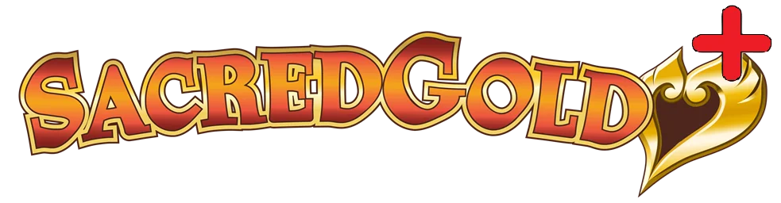
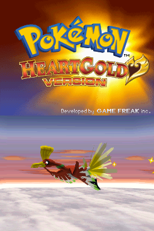
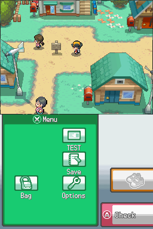
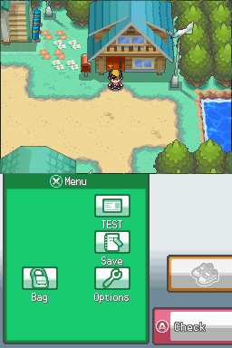
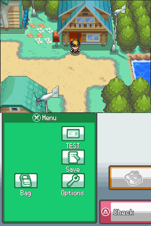

# Sacred Gold Plus

An independent continuation of Sacred Gold Plus 1.03, maintained by one fan. I started this to keep a game I enjoy alive, bring it to Italian and give others a place to help improve it. I'm one person learning as I go, and anyone who wants to join in is very welcome: players, testers, translators, artists and developers.

[Download](#download-104) · [How to play](PLAY.md) · [Game guide](GAME-GUIDE.md) · [Contribute](CONTRIBUTING.md)

Sacred Gold Plus adds Fairy typing, new Fairy moves and a wider camera option to Drayano's Sacred Gold. The original trainer teams and levels are retained, while their moves follow the Plus learnsets. The [game guide](GAME-GUIDE.md) explains these inherited changes and links to the original documentation.

## Download 1.04

**Version 1.04 is available.** Choose your language and camera below. Keep a backup of your game and save when updating; [the release notes](CHANGELOG.md#known-limits) explain what has been checked and what still needs testing.

Choose **one** download. Each ZIP contains one patch, a README, a **Manual** folder with the game guides, and optional **Cheats** in the selected language:

| Language | Normal Angle | New Angle |
| --- | --- | --- |
| Italian (IT) | [Download IT — Normal Angle](https://github.com/Umberto-DEV/sacred-gold-plus/releases/download/v1.04/Sacred-Gold-Plus-Normal-Angle-IT.zip) | [Download IT — New Angle](https://github.com/Umberto-DEV/sacred-gold-plus/releases/download/v1.04/Sacred-Gold-Plus-New-Angle-IT.zip) |
| English (US) | [Download US — Normal Angle](https://github.com/Umberto-DEV/sacred-gold-plus/releases/download/v1.04/Sacred-Gold-Plus-Normal-Angle-US.zip) | [Download US — New Angle](https://github.com/Umberto-DEV/sacred-gold-plus/releases/download/v1.04/Sacred-Gold-Plus-New-Angle-US.zip) |

**Normal Angle** uses the original HeartGold camera settings. **New Angle** keeps the wider, Black/White-inspired view from Sacred Gold Plus. Both have the same gameplay and fixes; neither is advertised as faster.

These downloads are **cumulative patches**, not complete games. Apply one directly to the exact **unmodified US HeartGold** game listed in the [installation guide](PLAY.md). It includes the earlier Sacred Gold and Plus changes retained in 1.04, together with this continuation's fixes. No earlier patch is required. IT and US select the output language; both start from the same US game. You do not need to browse the source folders or download GitHub's “Source code” ZIP to play.

[What changed in 1.04](CHANGELOG.md) · [Plans for 1.05](ROADMAP.md) · [All releases](https://github.com/Umberto-DEV/sacred-gold-plus/releases)

## See the game

| Title screen | Exploring New Bark Town |
| --- | --- |
|  |  |

The same scene and player position, with the two camera options:

| Normal Angle | New Angle |
| --- | --- |
|  |  |

[More screenshots: exploring New Bark Town, Italian dialogue and the accented keyboard](SCREENSHOTS.md). These are unedited captures from the 1.04 game.

## Development: 1.05 and beyond

These are candidates for future work, not a promise that everything will be included in one release:

- **1.05:** measured city performance improvements, remaining fixes, finishing the EV/IV stat display and in-game guide prototypes, English and Italian polish, and an initial scaling improvement that preserves the original graphics at 1×.
- **Later releases:** optional difficulty with smarter opponents and more demanding training, more languages and possibly an in-game language selector, Gen 5-inspired Pokémon battle animations, broader graphical improvements, and new areas and events.
- **Throughout development:** preserve saves and Nintendo DS compatibility, use repeatable tests, keep instructions simple, and make patches check the exact game version they start from.

[Read the development plan](ROADMAP.md). There is no release date yet.

## Help improve the game

[Report a problem](https://github.com/Umberto-DEV/sacred-gold-plus/issues/new/choose), [share an idea or ask a question](https://github.com/Umberto-DEV/sacred-gold-plus/discussions), or [contribute a fix or translation](CONTRIBUTING.md). A clear report from a player is useful even without programming experience.

AI tools help me investigate bugs, work on code and translations, write test scripts and prepare documentation. Further human review and playtesting are welcome. If future updates add new areas or artwork, the plan is to create those visuals by hand, with help from artists who want to contribute.

For contributors: what is in the folders?

`patches` contains the downloadable changes and file checks; `source` contains the tools and recipes used to build them; `.github` provides contribution forms, review rules and a file-checking script. Players only need the download links and installation guide above.

## Thanks to the original creators

Thank you to **NefariousnessNo3436** for creating Sacred Gold Plus, sharing its patches and documentation, and allowing others to build on it with credit. Thank you to **Drayano** for Sacred Gold and Storm Silver, and **mikelan / Mikelan98** for the Fairy-type work that made Plus possible.

The logo above comes from the [original Sacred Gold Plus post](https://www.reddit.com/r/PokemonROMhacks/comments/1m69jrj/sacred_gold_plus_fairy_type_full_implementation/). This is an independent community project, not an official release or endorsement by the earlier authors. [Full credits](CREDITS.md).
