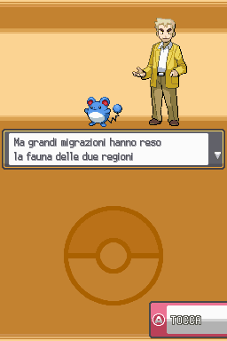
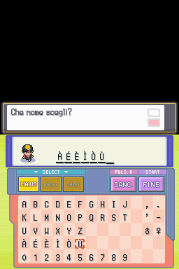

# See Sacred Gold Plus

These are real captures from 1.04, at the Nintendo DS's native resolution with both screens visible. They use a test character and contain no personal save information. The current packages produce the same game bytes shown in these images.

## Sacred Gold Plus 1.2 (proposed)

No curated 1.2 screenshots are published to `images/` yet. The captures below exist today only in the technical test bench (`local/docs/1.2/artefatto/`, not part of this public repository) and are not yet the finished, at-resolution player captures this page otherwise uses. If they are published, this is a proposed set of six, one pair per feature, with a suggested public filename and caption for each:

| Suggested filename | Source capture | Caption |
| --- | --- | --- |
| `images/07-camera-native-before.png` | `01-camera-mappa119-scodella1f-ingresso-base-EN.png` | Mt. Mortar's entrance with the wide Plus camera, before the fix. |
| `images/08-camera-native-after.png` | `01-camera-mappa119-scodella1f-ingresso-sgp12-EN.png` | The same doorway with 1.2's native indoor camera — no cheat needed. |
| `images/09-options-page.png` | `07-opzioni-v2-pagina-EN.png` | The new Sacred Gold Plus options page, opened with SELECT. |
| `images/10-options-continue-prompt.png` | `07-opzioni-v2-domanda-continua-EN.png` | The one-time question shown at Continue on an updated save. |
| `images/11-plus-difficulty-off.png` | `11-plus-allenatore-kobe-dragonair-lv47-spento-EN.png` | A trainer's Pokémon at its native level, Plus difficulty off. |
| `images/12-plus-difficulty-on.png` | `11-plus-allenatore-kobe-dragonair-lv52-acceso-EN.png` | The same Pokémon, Plus difficulty on: a higher level, same trainer. |

These would replace or sit alongside the 1.04 images below, not remove them; the title screen and New Bark Town captures are still accurate for 1.2 unless a new capture shows otherwise.

## Title screen

The existing title screen, captured from 1.04. This is not new artwork made for 1.04.

## Exploring New Bark Town

The English version, using the wider New Angle camera. This is an existing town, not a new area added in 1.04.

## Choose your camera

| Normal Angle (1.04 capture) | New Angle (1.04 capture) |
| --- | --- |
|  |  |
| The original HeartGold camera. | The wider view retained from Plus 1.03. |

These are 1.04 captures kept for reference. From 1.2 on, there is one download per language using the New Angle view shown on the right, and the Normal Angle view on the left is reached anywhere through the optional camera cheat instead of a separate download — see [how to play](PLAY.md#the-camera-indoors). Same scene, same position, same gameplay and fixes either way; neither option is advertised as faster.

## Italian dialogue and naming

| Italian dialogue | Accented characters |
| --- | --- |
|  |  |

The introduction is the existing one translated into Italian. The naming screen shows accented characters entered through the keyboard. Further language review and full-game testing are still welcome.

These captures show the selected screens, not a completed playthrough or a performance benchmark. The game artwork belongs to its original creators; see the [credits](CREDITS.md).

[Choose your download](README.md#download-12) · [Read the game guide](GAME-GUIDE.md) · [Report a problem](https://github.com/Umberto-DEV/sacred-gold-plus/issues/new/choose)
